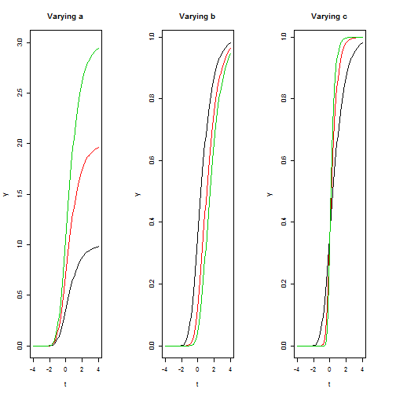

## What is the Gompertz function?

- The Gompertz function is a simple mathematical model for constrained growth as a function of time.

- It was named after [Benjamin Gompertz](http://en.wikipedia.org/wiki/Benjamin_Gompertz), who was a british mathematician and actuary.

- It takes the form:
  $$latex y(t)=a e^{-b e^{-c t}} $$

- a, b, and c are the three parameters that describe the shape as the function varies with time, t

---

## Why use it?

- The Gompertz function is practical for its simplicity and power
- With 3 simple parameters, you can easily model 
  - Population growth with finite resources
  - Tumor growth in a confined space
  - Product/technology share uptake to peak share

---

## What does each parameter do?

- Here are some examples showing how the curve moves with each parameter, leaving the other parameters fixed.

 

---

## Playing with it yourself!

- In order to understand what each parameter in the Gompertz function does, it is useful to play with each parameter and visually see it's effect on the shape of the curve.

- [My shiny app](https://bartellbl.shinyapps.io/myApp2/) lets the user change the three parameters and the plotting range interactively.

- Try it for yourself!

---
