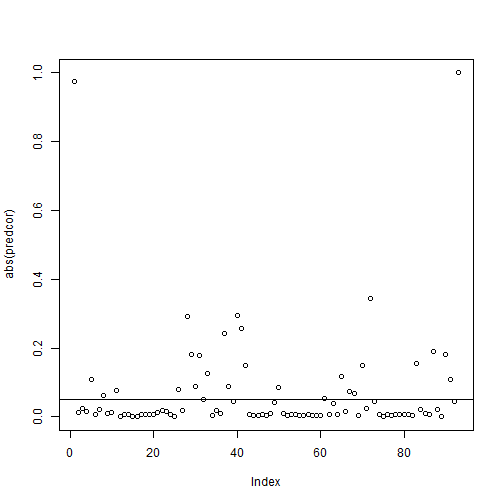
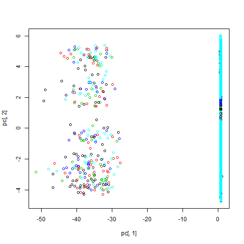

Practical Machine Learning Course Project
========================================================
#### Brandon Bartell

## Data Analysis
First, we downloaded the data, read it into R and converted it to a data frame.

```r
library(caret)
trainURL <- "http://d396qusza40orc.cloudfront.net/predmachlearn/pml-training.csv"
training<-read.csv(file=trainURL)
testURL <- "http://d396qusza40orc.cloudfront.net/predmachlearn/pml-testing.csv"
testing<-read.csv(file=testURL)
#summary(testing)
training<-data.frame(training)
testing<-data.frame(testing)
```

Looking at a summary of the training data only, we see that there are 19622 observations and 160 features, however many of these features have 19216 NA values. Since this is a sizable fraction of all observations, we elect not to use these features as predictors for our model.


```r
badind<-which(colSums(is.na(training))==sum(is.na(training$var_yaw_forearm)))
training<-training[-badind]
testing<-testing[-badind]
```

For ease of manipulation, we convert all predictors to numeric and calculate the absolute value of the correlation with the outcome classe to see which variables are most influential.


```r
t4<-data.frame(sapply(training,as.numeric))
corclasse<-function(x) cor(x,t4$classe)
predcor<-apply(t4,2,corclasse)
plot(abs(predcor))
abline(0.05,0)
```

 

```r
abs(predcor[order(abs(predcor), decreasing = TRUE)][1:30])
```

```
##               classe                    X        pitch_forearm 
##           1.00000000           0.97418025           0.34382583 
##         magnet_arm_x        magnet_belt_y         magnet_arm_y 
##           0.29596357           0.29034907           0.25667018 
##          accel_arm_x      accel_forearm_x     magnet_forearm_x 
##           0.24259262           0.18868540           0.18213336 
##        magnet_belt_z            pitch_arm  total_accel_forearm 
##           0.18003062           0.17768488           0.15453835 
##    magnet_dumbbell_z         magnet_arm_z      total_accel_arm 
##           0.14986919           0.14984293           0.12582518 
##     accel_dumbbell_x     magnet_forearm_y       cvtd_timestamp 
##           0.11864632           0.10783774           0.10769103 
##             roll_arm          accel_arm_y       pitch_dumbbell 
##           0.08769584           0.08705390           0.08623508 
##         accel_belt_z     total_accel_belt     accel_dumbbell_z 
##           0.07938728           0.07715617           0.07273933 
##    magnet_dumbbell_x            roll_belt total_accel_dumbbell 
##           0.06663609           0.06215134           0.05196331 
##              yaw_arm          yaw_forearm     magnet_forearm_z 
##           0.04926304           0.04551231           0.04529701
```

```r
t5<-t4[,-1]
```

Immediately we see that the classe outcome is perfectly correlated with itself. We also see that the X predictor is nearly perfectly correlated with classe, since it appears that the different observations were entered one class at a time. Thus, despite its correlation, X will not be a good predictor because it is an artifact of the way the data is ordered, not an intrinsic property of the measurements taken.

We can split our training data into the training and cross validation set

```r
set.seed(395)
t5$classe<-training$classe
inTrain<-createDataPartition(y=t5$classe,p=0.7,list=FALSE)
train<-t5[inTrain,]
cv<-t5[-inTrain,]
```

Next, we calculate the 2 most important principal components using the 91 prediction features to do some exploratory plots and see if they can explain the outcome classe.


```r
preProc1<-preProcess(train[,-length(train)],method="pca",pcaComp=2)
pc<-predict(preProc1,train[,-length(train)])
plot(pc[,1],pc[,2],col=train[,length(train)])
```

 

It looks like these two principal components do not, by themselves, effectively separate the classes.

Instead, lets use the 25 features whose absolute correlation with the classe outcome was greater than 0.05 and use these as our predictors henceforward.


```r
pc<-predcor[order(abs(predcor),decreasing=TRUE)][c(1,3:27)]
feat<-names(pc)
```

### Random Forest

We can build a random forest using our training data set. Lets see how well the algorithm performs by creating and averaging 20 trees.


```r
library(randomForest)
train$classe<-as.factor(train$classe)
ntrain<-train[feat]
cv$classe<-as.factor(cv$classe)
ncv<-cv[feat]
mf2<-randomForest(classe~.,data=ntrain,ntree=20)
pred<-predict(mf2,ncv)
tbl<-table(pred,ncv$classe)
tbl
```

```
##     
## pred    A    B    C    D    E
##    A 1665   21    0    0    0
##    B    4 1104   12    0    1
##    C    5   13 1008   13    3
##    D    0    1    6  951    6
##    E    0    0    0    0 1072
```

The table shows that we correctly classified 5812 of 5885 observations in the cross-validation set for an out of sample error rate of 1.3%. The true classe is the column header and our algorithm's prediction is the row header.

Applying this model to the test set, we get the following predictions

```r
set.seed(395)
ntest<-data.frame(sapply(testing,as.numeric))
ntest<-ntest[feat[-1]]
ntest$classe<-testing$classe
predtest<-predict(mf2,ntest)
predtest
```

```
##  1  2  3  4  5  6  7  8  9 10 11 12 13 14 15 16 17 18 19 20 
##  B  A  B  A  A  E  C  B  A  A  B  C  B  A  E  B  A  B  B  B 
## Levels: A B C D E
```

The first attempt to submit our predictions for the test set yielded 18/20 correct for an out of sample error rate of 10%.
